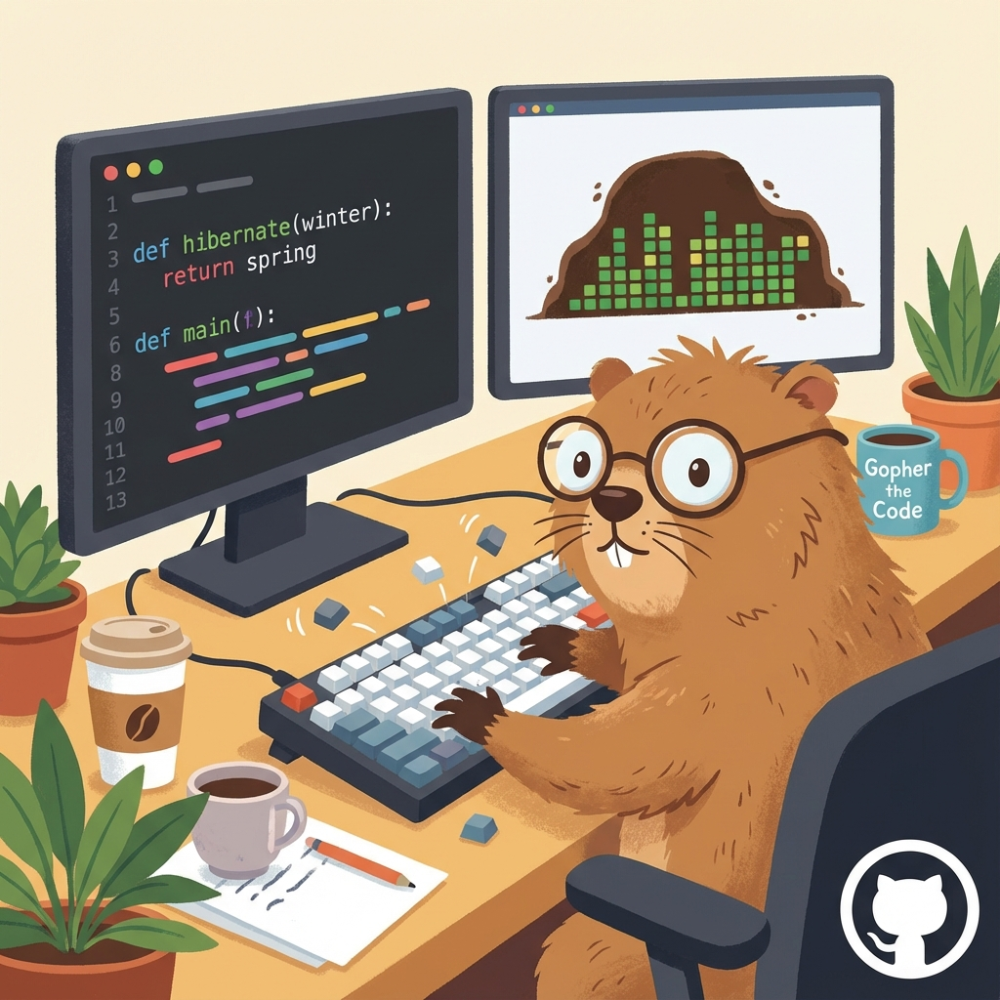

<!-- 
SYSTEM: GROUNDHOG_OS_V1.0
STATUS: CAFFEINATED
ACCESS: OPEN
-->

  

<h1 align="center">HANK // THE CODING GROUNDHOG</h1>

  <code>> WAKING UP FROM HIBERNATION...</code> 
  <code>> VISITOR DETECTED: FRIEND</code> 
  <code>> GRABBING COFFEE...</code>

  <b>[ SPECIES: MARMOTA MONAX (CODER) ]</b> 
  Software Engineer (and professional burrower) specializing in Backend Systems, Machine Learning, and Clean Architecture. 
  <i>"Digging deep into code, one bug at a time."</i>

<!-- AGENT_VISUALS: Insert assets/divider.png here -->

## 🛠 TOOLBOX (NOT JUST FOR DIGGING)

  <!-- Langs -->
  
  
  
  
   
  <!-- Frameworks/Tools -->
  
  
  
   
  <!-- DB/Infra -->
  
  
  

## 📊 ACTIVATION LEVELS

  

## 🥕 PAST EXCAVATIONS

<!--
| PROJECT | STATUS | DESC |
| :--- | :--- | :--- |
| **🔧 [project-one](https://github.com/hanlin888/project-one)** | `stable` | RESTful API, JWT Auth, CI/CD Pipeline. |
| **🧠 [ml-playground](https://github.com/hanlin888/ml-playground)** | `experimental` | CNNs, Tabular ML, Jupyter Notebooks. |
| **🗂 [tools-scripts](https://github.com/hanlin888/tools-scripts)** | `utility` | Automation scripts, Data cleanup tools. |
-->

## 📡 SIGNAL THE BURROW

  
  &nbsp;&nbsp;&nbsp;
  

  <code>> HIBERNATION_MODE_INITIATED</code>

  *Note: Top image is generated with AI.*

