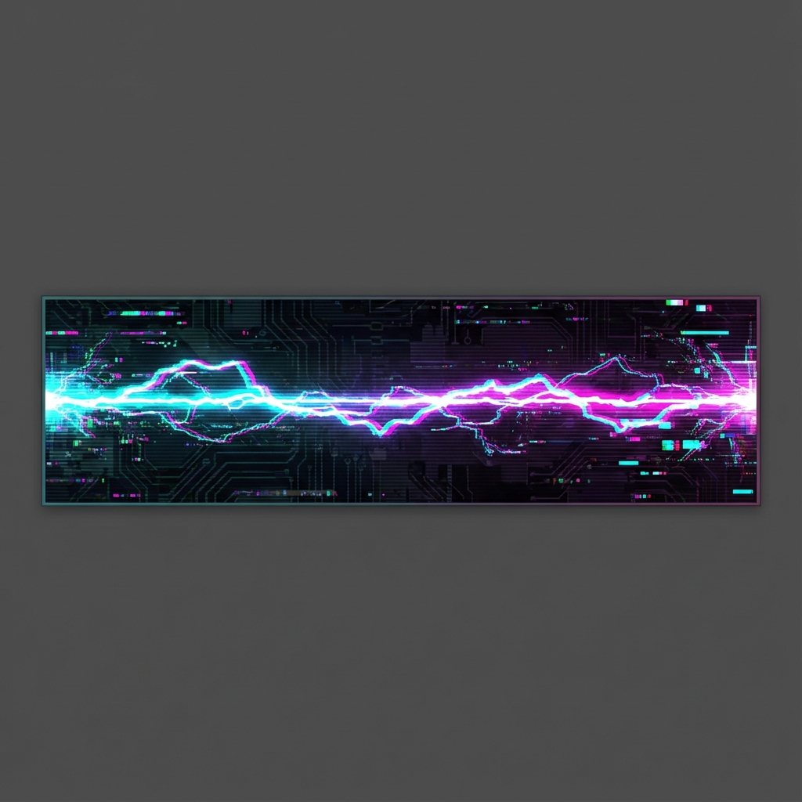

<!-- 
SYSTEM: TAOPUNK_V2.0
STATUS: ONLINE
ACCESS: PUBLIC
-->

  <!-- AGENT_VISUALS: Insert assets/cyberpunk-banner.png here -->
  

<h1 align="center">HANK // NETRUNNER</h1>

  <code>> INITIALIZING CONNECTION...</code> 
  <code>> USER AUTHENTICATED: GUEST</code> 
  <code>> LOADING BIO...</code>

  <b>[ TARGET_ID: HANK ]</b> 
  Software Engineer specializing in Backend Systems, Machine Learning, and Clean Architecture. 
  <i>"Building the digital infrastructure of tomorrow, one line of code at a time."</i>

<!-- AGENT_VISUALS: Insert assets/neon-divider.png here -->

## ⚡ NEURAL MODULES [TECH_STACK]

  <!-- Langs -->
  
  
  
  
   
  <!-- Frameworks/Tools -->
  
  
  
   
  <!-- DB/Infra -->
  
  
  

## 📂 MISSION LOGS [DEPLOYED_SYSTEMS]

| PROJECT_ID | STATUS | DATA_PACK |
| :--- | :--- | :--- |
| **🔧 [project-one](https://github.com/your-user/project-one)** | `stable` | RESTful API, JWT Auth, CI/CD Pipeline. |
| **🧠 [ml-playground](https://github.com/your-user/ml-playground)** | `experimental` | CNNs, Tabular ML, Jupyter Notebooks. |
| **🗂 [tools-scripts](https://github.com/your-user/tools-scripts)** | `utility` | Automation scripts, Data cleanup tools. |

<!-- AGENT_VISUALS: Insert assets/neon-divider.png here -->

## 📡 ENCRYPTED CHANNELS [CONTACT]

  
  &nbsp;&nbsp;&nbsp;
  

  <code>> END_OF_LINE</code>

